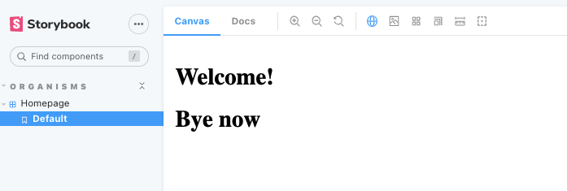
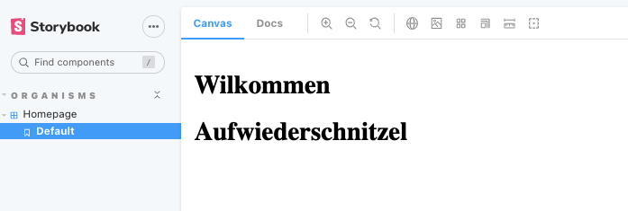

## README

This is a POC demonstrating a full working setup of nextjs, storybook and i18n with <a href="https://github.com/isaachinman/next-i18next">next-i18next</a>. It uses the <a href="https://www.npmjs.com/package/storybook-addon-i18next">storybook-addon-i18next</a>. 

### To Run
**Storybook**
```
npm i
npm run storybook
```
**Nextjs**
in a separate terminal
```
npm i
npm run dev
```
for nextjs add `/de` to the path to see the German version.
### Examples
Click on the globe to switch languages.


